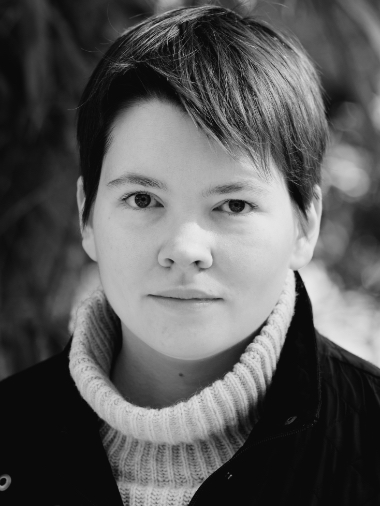
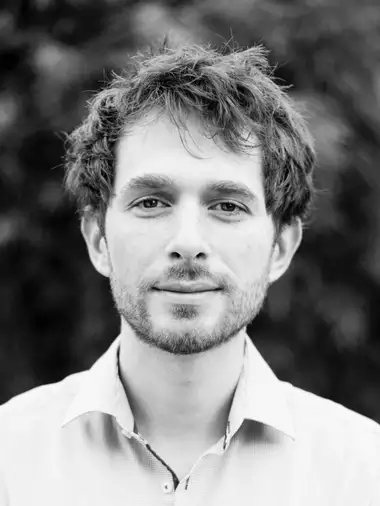
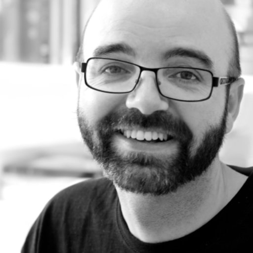
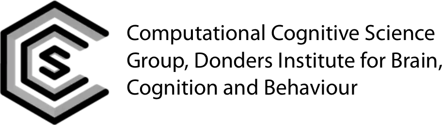
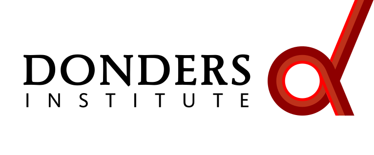
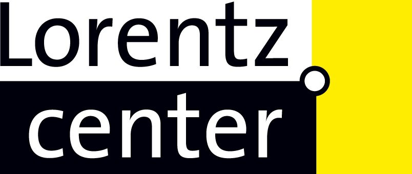

+++
title = 'Theoretical Modeling Workshop'
ShowToc = true
+++



Cognitive and/or psychological theories often start as verbal descriptions of observed regularities in human behavior and some intuitive ideas about their causal origins. Such informal verbal theories are a good place to start explanations of cognition, but are also limited. For example, it is difficult to test if an informal theory is internally consistent, if the theory explains observed phenomena, and if the processes assumed by the theory are computationally and physically realizable. To make verbal theories more precise, scientists engage in theoretical modeling.  

A theoretical model describes, in a precise (formal) language, how we think that (a part of) cognition or behavior may work. In this workshop, you will learn to build such formal models. Afterwards, you can use the acquired formal modeling skills to develop your own theoretical models in your domain of interest in cognitive science or psychology.

The workshop is open to interested Master students and PhD candidates. Check out the full [schedule](#workshop-schedule) below. [Registrations](/tm-workshop/registration) are on a first come, first served basis.

The workshop will take place from September 2nd till October 17th.
There will be four contact sessions held online in Gathertown: the welcome session on September 5th, two practice sessions on September 12th and 19th, and the closing session on October 17th. 

## Opening lecture



## Workshop schedule

Week | Date and time | Activity type | Activity 
-----|---------------|---------------|----------
**1**  |  | :book: | Read [Chapter 1](https://computationalcognitivescience.github.io/lovelace/part_i/intro) and [Chapter 2](https://computationalcognitivescience.github.io/lovelace/part_i/foundations) of the [Theoretical Modeling textbook](https://computationalcognitivescience.github.io/lovelace), read [van Rooij & Baggio (2021)](https://journals.sagepub.com/doi/full/10.1177/1745691620970604) and watch the video of the opening lecture (optional: [Cummins (2000)](https://doi.org/10.7551/mitpress/2930.003.0009) [:page_facing_up:](https://www.researchgate.net/profile/Robert-Cummins-4/publication/282926459_%27How_does_it_Work%27_vs_%27What_are_the_Laws%27_Two_Conceptions_of_Psychological_Explanation/links/5fac2471299bf18c5b68d4fe/How-does-it-Work-vs-What-are-the-Laws-Two-Conceptions-of-Psychological-Explanation.pdf))
|| Thursday, September 5, 13:30–15.30 | :busts_in_silhouette: | Welcome meeting | 
**2** | | :book: | Read [Chapter 3](https://computationalcognitivescience.github.io/lovelace/part_ii/math) and [Chapter 4](https://computationalcognitivescience.github.io/lovelace/part_ii/subset)
|| Thursday, September 12, 13:30–16.30 | :busts_in_silhouette: :pencil: | Formalisation Practice I | 
||  | :pencil: | Read feedback on the first formalisation practice exercise | 
**3** | Thursday, September 19, 13:30–16.30 | :busts_in_silhouette: :pencil: | Formalisation Practice II | 
**4** | September 23–29 | :surfer: | Break | 
**5** | | :book: :pencil: | Select and read a paper for the assessment exercise (optional: [Hahn et al. 2003](https://doi.org/10.1016/S0010-0277(02)00184-1) [:page_facing_up:](https://pcl.sitehost.iu.edu/rgoldsto/courses/concepts/hahnsim.pdf) or a different paper in your domain of interest) |
|| | :pencil: | Start working on the assessment exercise |
**6** | | :pencil: | Finish working on the assessment exercise | 
**7** | October 17, 13:30–15:30 | :busts_in_silhouette: | Closing session with QA, reflections, discussion, feedback |

## Organisers

| | | |
----------|-----|------
 | | **Natalia Scharfenberg** is a PhD candidate working on meta-theory in the [Computational Cognitive Science](https://www.ru.nl/en/departments/donders-centre-for-cognition/computational-cognitive-science) group, and a junior lecturer at the School of Artificial Intelligence (AI) at Radboud University. She coordinates this workshop.| 
 | | **Mark Blokpoel** is a computer scientist and computational cognitive scientist. He is an assistant professor at the School of AI and a senior researcher in the [Computational Cognitive Science](https://www.ru.nl/en/departments/donders-centre-for-cognition/computational-cognitive-science) group. He coordinates the Radboud-Aarhus Computational Cognitive Science collaboration. | 
 | | **Iris van Rooij** is a psychologist and computational cognitive scientist. She is a professor at the School of AI, heads the [Computational Cognitive Science](https://www.ru.nl/en/departments/donders-centre-for-cognition/computational-cognitive-science) group, and is a guest professor at Aarhus University. 
 | | **Joshua Skewes** is an Associate Professor in Cognitive Science. He is Head of [Department for Linguistics, Cognitive Science, and Semiotics](https://cc.au.dk/en/about-the-school/departments/linguistics-cognitive-science-and-semiotics), and Head of Department of Culture, Cognition, and Computation at Aarhus University, Denmark. |

## License

The workshop materials are released under the [CC BY 4.0](https://creativecommons.org/licenses/by/4.0/) license. The workshop website is made with [Hugo](https://gohugo.io) using the [PaperMod](https://github.com/adityatelange/hugo-PaperMod) theme released under the [MIT license](https://github.com/adityatelange/hugo-PaperMod/blob/master/LICENSE).  
The artwork by Danielle Navarro is released under the [CC BY-SA 4.0](https://creativecommons.org/licenses/by-sa/4.0/) license, and used with permission.

## Acknowledgements

 The workshop is part of an educational collaboration between the [AI programme](https://www.ru.nl/en/education/bachelors/artificial-intelligence) at [Radboud University](https://www.ru.nl), and the [Cognitive Science programme](https://cc.au.dk/en/about-the-school/subjects/cognitive-science) at Aarhus University, Denmark.
This work was in part supported by a [Distinguished NIAS Lorentz Fellowship](https://nias.knaw.nl/fellowships/distinguished-lorentz-fellowship/) awarded to [Iris van Rooij](https://nias.knaw.nl/fellow/rooij-iris-van).
We thank [Katarzyna Gugnowska](https://www.cbs.mpg.de/person/gugnowska/1843226) and [Alexander Enge](https://www.cbs.mpg.de/person/enge/1843226) who organised the [Tools for Theory workshop in 2021](https://www.cbs.mpg.de/en/tools-for-theory).

## Contact

For questions related to the workshop, please contact [Natalia](mailto:natalia.scharfenberg@donders.ru.nl), and CC [Iris](mailto:iris.vanrooij@donders.ru.nl) and [Mark](mailto:mark.blokpoel@donders.ru.nl).

|   |      |   |       |      |   |
|---|:----:|---| :-----:|-----|---|
||  | |  ||
||  | |   ||
|| | |  ||